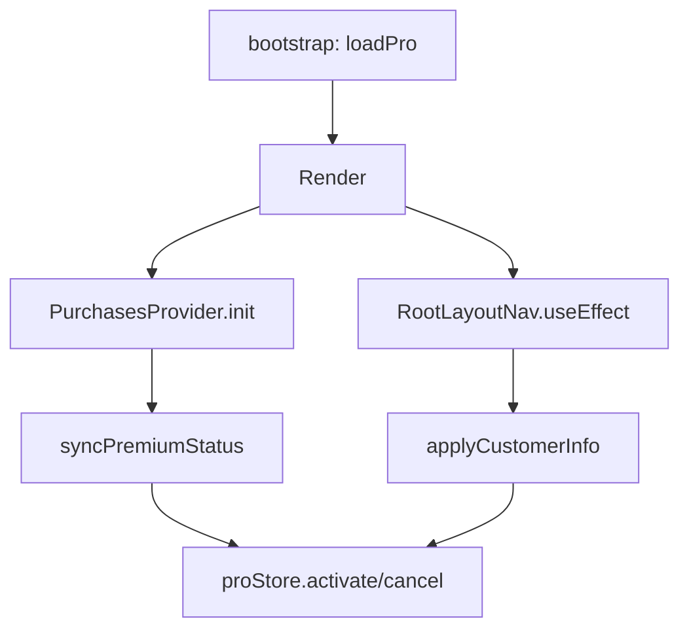

# Auditoría del sistema Pro — Bugs y mejoras

## Bugs encontrados

### 🟠 B2 — Logout de sesión no limpia `proStore.isPro`

**Archivo:** `src/contexts/PurchasesContext.tsx:104-109`

```typescript
useEffect(() => {
  if (!session && !user) {
    logoutUser().catch(() => {});
    setIsPremium(false);   // solo en el contexto
    // proStore.isPro NO se actualiza
  }
}, [session, user]);
```

Cuando un usuario cierra sesión, `proStore.cancelPermanentPro()` nunca se llama. Si otro usuario usa el dispositivo, `proStore.isPro` sigue siendo `true` hasta que RevenueCat sincronice en el próximo login.

**Riesgo:** Medio — fuga de features Pro al cerrar sesión.

**Fix sugerido:** Llamar `useProStore.getState().cancelPermanentPro()` en el logout.

---

### 🟠 B3 — Paywall custom (`app/paywall.tsx`) no procesa compras

**Archivo:** `app/paywall.tsx:322-330`

```typescript
const handleSubscribe = () => {
  // TODO: Implement subscription logic
  console.log("Subscribing to:", selectedPlan);
  router.back();
};
```

Paywall con UI completamente diseñada (shimmer, pricing cards, FAQ, trust guarantees) cuyo botón de compra es un stub. Si la ruta es accesible por error de navegación, el usuario toca "Unlock" y no pasa nada.

**Riesgo:** Alto para UX — confunde usuarios y quema conversiones si alguien llega ahí.

**Fix sugerido:** Implementar la lógica con RevenueCat o eliminar/redirigir a `PaywallModal`.

---

### 🟡 B4 — `ReverseTrialSlide` compra `packages[0]` sin verificar que sea trial

**Archivo:** `src/features/onboarding/components/custom/ReverseTrialSlide.tsx:107-108`

```typescript
const mainPackage = packages[0];
const result = await purchasePackage(mainPackage);
```

No verifica que el paquete tenga `introductoryPrice` ni que sea el plan correcto. Si los offerings de RevenueCat cambian el orden, el usuario podría pagar el precio completo sin trial.

**Riesgo:** Medio — podría cobrar de más al usuario.

**Fix sugerido:** Buscar el paquete con `introductoryPrice` explícitamente, no asumir `[0]`.

---

### 🟡 B5 — Sincronización duplicada entre `PurchasesContext` y `_layout.tsx`

**Archivos:** `src/contexts/PurchasesContext.tsx:71-102` y `app/_layout.tsx:224-284`

Ambos ejecutan `syncPremiumStatus` / `applyCustomerInfo` en paralelo al montar la app. Ambos llaman a RevenueCat API y actualizan `proStore`. Posible race condition donde uno activa Pro y el otro lo desactiva (o viceversa).



**Riesgo:** Bajo (ambas llamadas devuelven lo mismo) pero duplica requests a RevenueCat.

**Fix sugerido:** Unificar en una sola fuente. Por ej., que solo `PurchasesContext` sincronice y `RootLayoutNav` solo escuche cambios vía `CustomerInfoUpdateListener`.

---

### 🟡 B6 — Widget no actualiza estado Pro hasta que se visita la tab de rutinas

**Archivos:** `app/(tabs)/two.tsx:186`, `src/widgets/RoutinesWidget.tsx:187`

El widget recibe `isPro` via `AsyncStorage.setItem(WIDGET_PRO_KEY, ...)`, pero esto solo ocurre en `two.tsx` (tab de rutinas). Si el usuario compra Pro desde el hamburger menu y cierra la app, el widget sigue mostrando upsell hasta que vuelva a la tab de rutinas.

**Riesgo:** Bajo — se autcorrige al visitar la tab.

**Fix sugerido:** Sincronizar `WIDGET_PRO_KEY` también desde `proStore` en un listener global cuando cambie `isPro`.

---

### 🟡 B7 — Streak shield: si se acepta, no se incrementa la racha

**Archivo:** `src/store/appStreakStore.ts:128-132`

Cuando se activa un shield, la racha se mantiene en el valor anterior (`newCount = data.count`), no se incrementa. El día del gap no cuenta como día de racha. Tras aceptar el shield, la racha se "congela" pero no avanza. Puede confundir al usuario que ve el mismo contador y cree que no avanzó.

**Riesgo:** Bajo — funcionalmente es correcto (no pierde racha pero no avanza), pero UX confusa.

---

## Puntos de mejora

### 💡 M1 — Eliminar duplicación de lógica de sincronización

Los dos mecanismos paralelos (`PurchasesContext` + `RootLayoutNav`) deberían consolidarse en uno solo para reducir complejidad y risks de race conditions.

### 💡 M2 — Añadir fallback offline para estado Pro

Si RevenueCat no responde (red caída, API down), el app no debería asumir que el usuario perdió Pro. Considerar:

- Usar `AsyncStorage` como fuente temporal si la API no responde
- Invalidar el estado solo después de N días sin conexión exitosa
- Mostrar un indicador "modo offline" si no se puede verificar

### 💡 M3 — `togglePro()` no debería estar en producción

Aunque no tiene UI, el método `togglePro()` está en el bundle de producción. Considerar:

```typescript
if (__DEV__) {
  // togglePro solo disponible en dev
}
```

### 💡 M4 — Renombrar `activatePermanentPro` / `cancelPermanentPro`

El nombre sugiere que es permanente, pero es una suscripción que caduca. Mejor:

- `activatePro()` / `deactivatePro()`
- `setProStatus(active: boolean)`

### 💡 M5 — Poner un tope al multiplicador de coronas

`getMultiplier(): 1 + streak * 0.15` escala sin límite. Un usuario con racha de 100 días tendría 16x. Puede desbalancear la economía. Sugerir un cap (ej. 3x o 5x).

### 💡 M6 — El `source="debug_panel"` en achievements.tsx es identificador de produção

**Archivo:** `app/achievements.tsx:347`

```typescript
source="debug_panel"
```

Parece un remnant de debugging. Cambiar a `source="achievements_egg"` o similar.

### 💡 M7 — `docs/pro-mode-audit.md` está desactualizado

Referencia `src/components/ProTrialOfferModal.tsx` que no existe (ahora es `ReverseTrialSlide.tsx`). Actualizar o eliminar.

### 💡 M8 — Inconsistencia en persistencia de stores

- `proStore`: persiste manualmente con `AsyncStorage.setItem(JSON.stringify(...))`
- `appStreakStore`: persiste manualmente
- `eggStore`: usa `persist` middleware de Zustand

Tres approaches distintos para lo mismo. Estandarizar.

### 💡 M9 — No hay analytics de revenue

PostHog captura eventos de compra pero no hay dashboard de LTV, MRR, conversión por fuente, etc. Integrar RevenueCat + PostHog para tracking de revenue.

### 💡 M10 — Proteger endpoints de Supabase del lado del servidor

Todos los gates Pro son client-side (Zustand/AsyncStorage). Cualquier RPC o Edge Function que dependa de `isPro` debería verificar el entitlement desde el lado del servidor usando el token de RevenueCat o un claim en Supabase Auth.

---

## Resumen de severidad

| ID | Tipo | Severidad | ¿Afecta ingresos? |
|----|------|-----------|-------------------|
| B1 | Bug | 🔴 Alta | Sí — usuario paga y no obtiene Pro |
| B2 | Bug | 🟠 Media | Sí — posible fuga de features |
| B3 | Bug | 🟠 Media | Sí — paywall no funcional |
| B4 | Bug | 🟡 Media | Sí — podría no aplicar trial |
| B5 | Bug | 🟡 Baja | No — solo duplica requests |
| B6 | Bug | 🟡 Baja | Sí — widget no se actualiza |
| B7 | UX | 🟡 Baja | No — funcionalmente correcto |
| M1-M10 | Mejora | — | Varía |

**Prioridad de acción:** B3 → B2 → B4 → M6 → M7 → resto.
